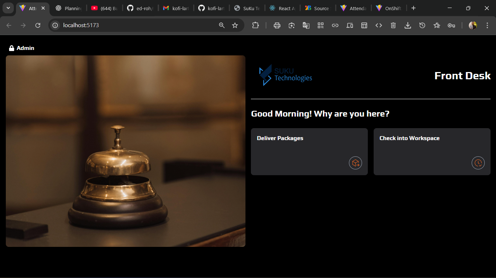
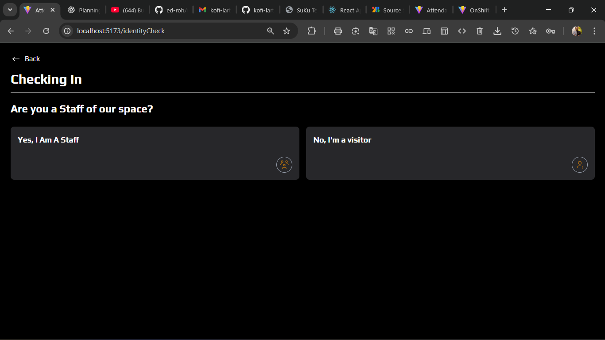
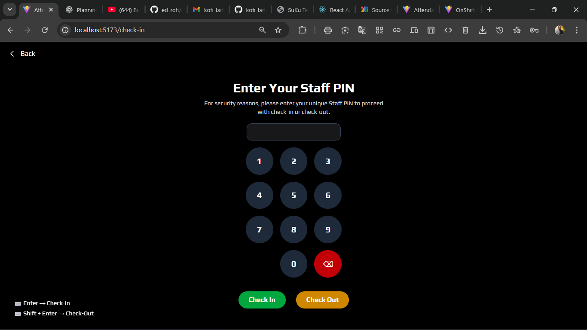
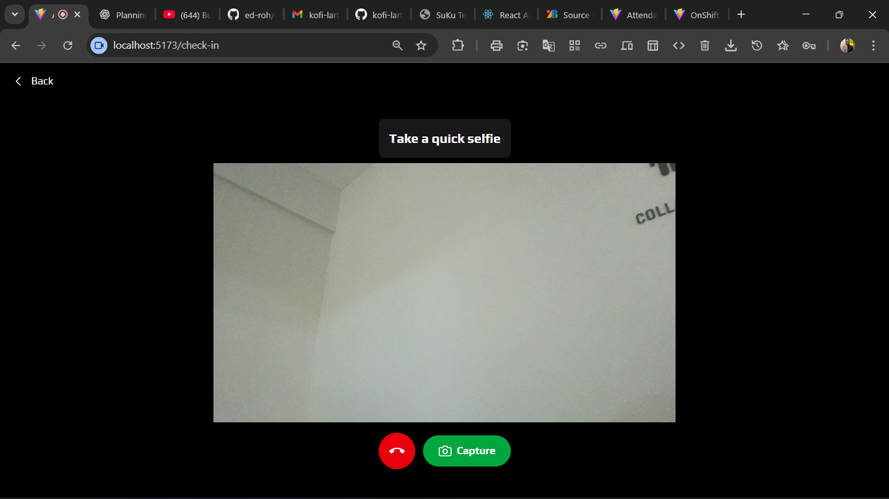
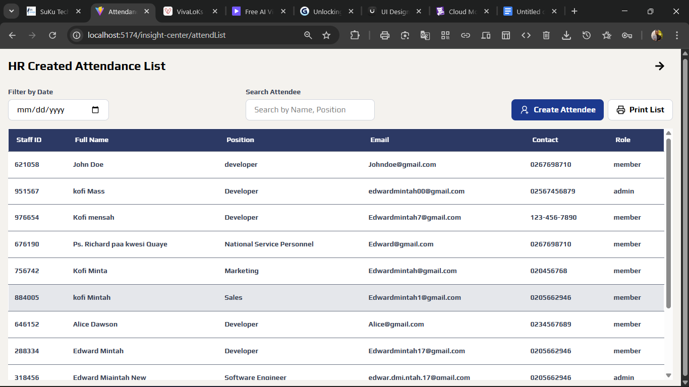
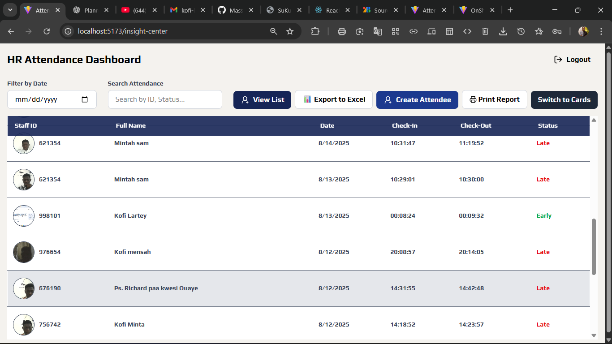

# 📊 Attendance Management System

An **Attendance System** built with **React + TailwindCSS**.  
This system helps organizations track staff check-ins with screenshots for verification and provides an **admin dashboard** for managing staff, exporting attendance, and auditing records.  

---

## 🚀 Features

- ✅ **Staff Check-in** using Staff ID (with screenshot capture).  
- 👤 **User Mode** – staff can log their attendance.  
- 🛠️ **Admin Mode** – create staff, search attendance records, and manage users.  
- 📑 **Reports** – export attendance data to Excel or print for audits.  
- 🎨 **Modern UI** – built with React + TailwindCSS for a clean, responsive interface.  

---

## 📸 Screenshots

### 🔹 Staff Check-in Page





### 🔹 Admin Dashboard




---

## 🏗️ Tech Stack

- **Frontend:** React, TailwindCSS  
- **State Management:** React Hooks / LocalStorage  
- **Exports & Printing:** ExcelJS, Print API  
- **Version Control:** Git & GitHub  

---

## ⚡ Getting Started

### 1️⃣ Clone the Repository
```bash
git clone https://github.com/Massive12356/Attendance-System.git
cd attendance-system
npm install
npm run dev

👨‍💻 Author

Edward Mintah
Frontend Developer @ Suku Technologies